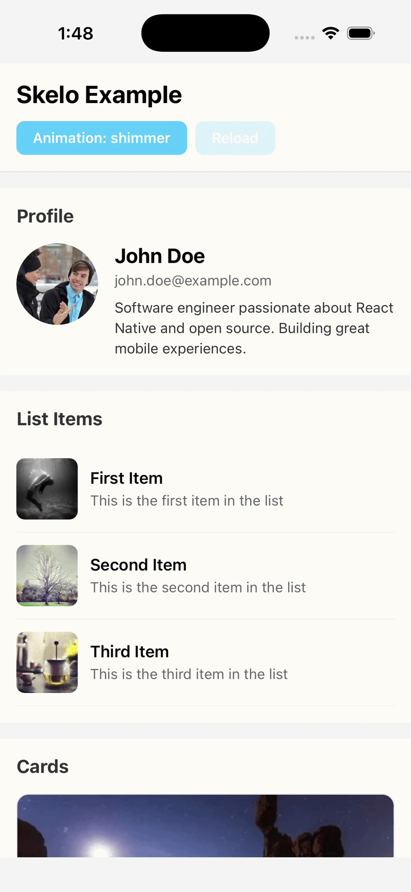
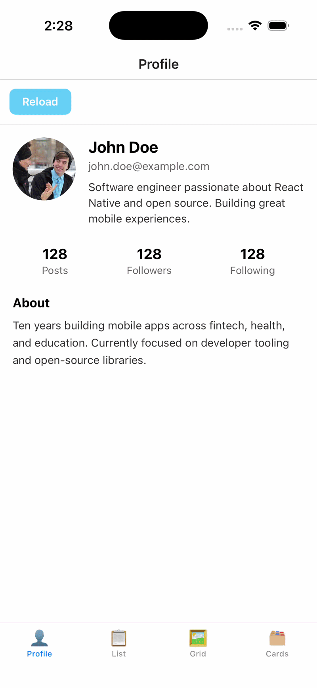

<div align="center">

# 🦴 react-native-skelo

### Write your UI once. Skelo builds the loading state — automatically.

[](https://www.npmjs.com/package/react-native-skelo)
[](https://www.npmjs.com/package/react-native-skelo)
[](./LICENSE)
[](https://github.com/shubhanshubb/react-native-skelo)

<br />


&nbsp;&nbsp;


</div>

<br />

**Stop building and maintaining a second copy of your UI just for loading states.** Wrap your components in `<Skeleton>` and Skelo generates a matching skeleton — sized from the styles you already wrote.

```tsx
<Skeleton loading={isLoading}>
  <ProfileCard user={user} />
</Skeleton>
```

That's the whole API. No skeleton screens to hand-draw, no keeping two layouts in sync.

> ⚠️ **Pre-release (`0.0.x`)** — evolving fast; the API may change before the stable `0.1.0`.

---

## ✨ Features

- 🪄 **Zero-config** — wrap a component, get a skeleton. No setup, no separate loading screen.
- 🧠 **Sees inside your components** — introspects custom components automatically (no inlining).
- 📋 **Lists included** — `FlatList` / `SectionList` render skeleton rows while data loads.
- 🎨 **Shimmer · Pulse · None** — built-in animations on the native driver.
- 🪶 **No dependencies** — no `reanimated`, no gradient library. Just `react` + `react-native`.
- 📐 **Style-aware** — every skeleton is sized from your real element styles.

---

## 📦 Installation

```bash
npm install react-native-skelo
```

**That's it — no other dependencies.** Everything (including custom-component introspection) works out of the box.

> React 18 apps: add `"react-reconciler": "0.29.x"` to your deps (Skelo ships targeting React 19's `0.31`).

---

## 🚀 Usage

### Just wrap it

```tsx
import { Skeleton } from 'react-native-skelo';

function Screen({ loading, user }) {
  return (
    <Skeleton loading={loading} animation="shimmer">
      <ProfileCard user={user} />
    </Skeleton>
  );
}
```

Skelo renders `ProfileCard`, reads its real `View`/`Text`/`Image` tree + styles, and draws a matching skeleton while `loading` is `true`. When it's `false`, your real UI renders.

### Lists

Wrap a `FlatList` — Skelo fills it with skeleton rows while the data loads:

```tsx
<Skeleton loading={loading} count={6}>
  <FlatList data={items} renderItem={renderItem} />
</Skeleton>
```

### Keep something visible

```tsx
<Skeleton loading={loading}>
  <Skeleton.Ignore>
    <Text style={styles.heading}>Profile</Text>   {/* stays real */}
  </Skeleton.Ignore>
  <ProfileBody />
</Skeleton>
```

### Generate from a StyleSheet

```tsx
<Skeleton loading={loading} styles={styles} excludeStyles={['container']} />
```

### Custom skeleton for a component

```tsx
import { Skelo } from 'react-native-skelo';

Skelo.register({
  name: 'Avatar',
  component: Avatar,
  strategy: (props, { primitives }) => <primitives.Circle size={props.size ?? 40} />,
});
```

---

## ⚙️ `<Skeleton>` props

| Prop | Type | Default | Description |
|---|---|---|---|
| `loading` | `boolean` | — | Show skeleton (`true`) or real content (`false`) |
| `animation` | `'shimmer' \| 'pulse' \| 'none'` | `'shimmer'` | Animation style |
| `duration` | `number` | `1200` | Animation duration (ms) |
| `baseColor` / `highlightColor` | `string` | theme | Skeleton colors |
| `borderRadius` | `number` | `4` | Default corner radius |
| `count` | `number` | `6` | Placeholder rows for a `FlatList`/`SectionList` |
| `deep` | `boolean` | auto | Force component introspection on/off (auto when available) |
| `styles` | `StyleSheet \| style[]` | — | Generate from styles instead of children |
| `accessibilityLabel` | `string` | `'Loading content'` | Screen-reader label |

Also exported: `withSkeleton`, `SkeletonIgnore`, `StyleSkeleton`, the primitives (`SkeletonBox`, `SkeletonText`, `SkeletonImage`, `SkeletonCircle`), and `Skelo` (`register` / `fromStyles`).

---

## 🧩 How it works

- **Host elements** (`View` / `Text` / `Image`) are read directly (`React.Children` + `StyleSheet.flatten`).
- **Custom components** are expanded by a tiny JS-only `react-reconciler` renderer (bundled) that renders them off-screen to recover their real host tree + styles — then feeds the same skeleton engine.
- Anything Skelo can't introspect (native content) is measured and shown as one size-matched block.

---

## ⚠️ Good to know

Skelo skeletonizes **what your component renders during loading**:

- Introspection **runs mount effects** — a screen that fetches on mount may fetch twice. Prefer it for presentational trees; register a plugin for effect-heavy screens.
- It renders **outside your providers** — components needing navigation/theme/redux context fall back to a measured block.
- **Native content** (`WebView`, `MapView`, `Video`, …) lives outside React, so it becomes a single sized block.
- A **data-driven list/grid** that renders nothing while loading has nothing to skeletonize — keep placeholder items rendered (see the [example](./example)).

---

## 📋 Requirements

- React Native (New Architecture recommended)
- React 19 (React 18 → override `react-reconciler` to `0.29`)
- No other dependencies

---

## 📄 License

MIT © [Shubhanshu Barnwal](https://shubhanshubb.dev)
